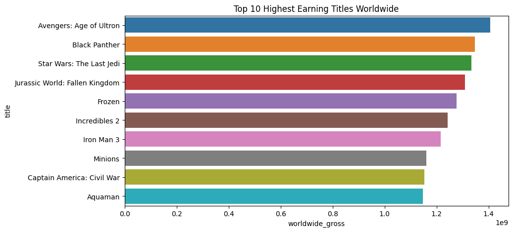
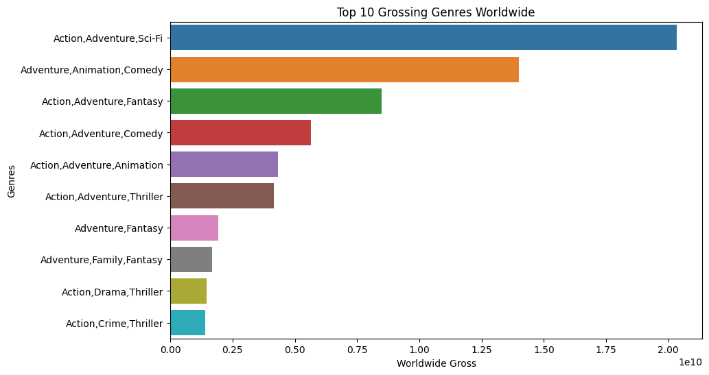
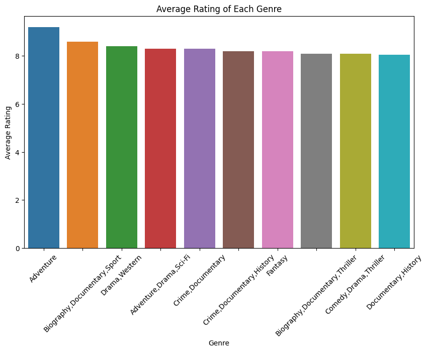
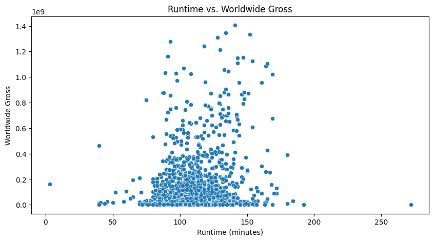
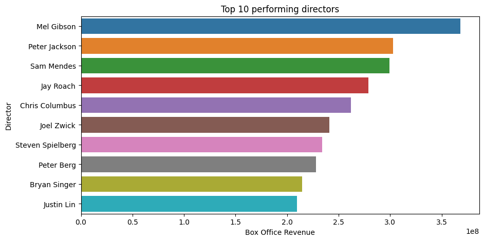

## Overview

This project analyzes different data sets to help Microsoft's make informed decisions as they set up a new movie studio. Microsoft has not ventured into this space before, and want to know what type of movies to create.
1. The highest earning genre in the movie industry is action, adventure, sci-fi
2. The top rated genre is adventure
3. The top performing director by box office revenue is Mel Gibson
4. There is not much correlation between movie runtime and the movies earnings, though most movies settle around the same runtime range overall

## Business Problem

Microsoft aims to venture into the multi-billion dollar film sector by establishing its own movie studio, despite lacking prior experience in the industry. Therefore, an in-depth analysis is crucial in order to identify the most successful genres in the box office and provide actionable insights for Microsoft executives.

## The Data Sets

The data for this project was sourced from online databases related to films and television series, specifically IMDB and Box Office Mojo.

IMDB: This data was provided in a SQLite database comprising eight interconnected tables. These tables included information on movie ratings, alternate movie titles (AKAs), directors, writers, and more. There were +73000 films.

Box Office Mojo: The data from Box Office Mojo was in CSV format, detailing each film's studio, domestic gross earnings, foreign gross earnings, and year of release. It contained information on +3300 films. However, it did not include the genre for each film.

Rotten Tomatoes is an online aggregator of critic reviews for movie and TV show. The key data here was rating, genre, director and box office earnings.

## Methods

The methods used were data preparation, analysis and visualization. 
The data was adequately prepared for analysis by cleaning it, and performing several alterations to the data in preparation for visualization.

## Findings

The highest earning movie was *Avengers: Age of Ultron*

The top 3 grossing genres by worldwide gross was *Action, Adventure, Sci-Fi* , *Adventure, Animation, Comedy* and *Action, Adventure, Fantasy* 

The highest rated genre was *adventure*, *adventure* is also part of the combinations seen above in the top 3 grossing genres

There is not much correlation between movie runtime and the movies earnings, though most movies settle around the same runtime range overall. (50 - 200 mins range)

The top performing director by box office revenue is *Mel Gibson*, followed by *Peter Jackson* and *Sam Mendes*

## Conclusions
The analysis yields the following recommendations:

1. Microsoft should create films with the adventure genre as it is the top rated genre
2. Microsoft should work with the top 3 grossing directors.
- Mel Gibson, 
- Peter Jackson
- Sam Mendes

Most preferrably Mel Gibson who has had the highest box office revenue

3. Microsoft should also make films in the genres with the highest worldwide grossing (revenue). The top 3 are
- Adventure
- Biography,Documentary,Sport
- Drama,Western
4. Microsoft should not worry so much about the effects of runtime on their movies, as long as they are in the 50-200 minute range but it might be helpful to keep it at about 150 minutes, which appears to host a few of the highest world wide gross earnings.
5. Microsoft should encourage audience feedback as ratings seem to have high correlation with earnings, as it is related to the top grossing genre

This analysis is not conclusive and further review of other related data sets may be needed to fully guide microsoft's new studio. 
For example:
- If there is a relationship between production budget and box office gross

You can find the full notebook in the following link, with much more detail: https://github.com/retiredboy/Microsoft-Studio-Box-Office-Analysis.git